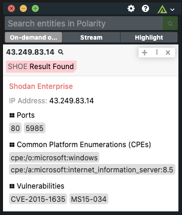
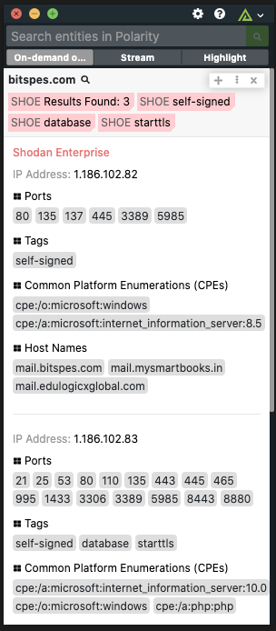

# Polarity Shodan Enterprise Integration

Polarity's Shodan Enterprise Integration gives users access to the Shodan `data/internetdb` endpoint data containing network information about virtually all IPs on the Internet, allowing you to search by for IPs and Domains.

> ***NOTE:*** Before this integration can function correctly, please use the `npm run build` command to install system level dependencies.

<div style="display:flex; justify-content:flex-start; align-items:flex-start;">
  
  
</div>

To learn more about Shodan, please visit the [official website](https://www.shodan.io/).

## Shodan Enterprise Integration Options
### Max Number Of Results:
The maximum number of results we will return from the internetdb data set when you search.

## **Database and API Integration Options**
Internally, this integration is downloading a compressed database containing the `data/internetdb` data, decompressing it, and formatting it for searching.  This process can require anywhere from 30-1200GB of storage, depending on your configuration and can take upwards of 30 minutes when first running the integration.  Due to the nature of obtaining this data, we have put all of the settings/options related to the database and API for this integration in the `./config/config.js` file. After changing a setting  in the `config.js` you will need to restart your integration using the `Actions -> Restart Integration` dropdown option.

> ***NOTE:*** If you are getting errors that do not seem to have an obvious solution, try running `npm run reset-database` then restarting the integration. (*Warning*: This will delete the current database refresh progress, and force a clean database refresh)

### **Shodan Enterprise Api Key**: 
Your API Key used to access the /data/internetdb endpoint on the Shodan API.
If you would prefer to set this in an environment variable instead, use SHODAN_ENTERPRISE_API_KEY as the variable name. The value of the property in the `config.js` will be prioritized over the environment variable.

### **Shodan Data Refresh Time**: 
How often/when to refresh the local data source with the up to date data from the Shodan API.  This is outline in Cron Format and is defaulted to the first of every month at midnight UTC. Helpful Resources: https://crontab.guru/.
```
'* * * * * *'
 ┬ ┬ ┬ ┬ ┬ ┬
 │ │ │ │ │ └ day of week (0 - 7) (0 or 7 is Sun)
 │ │ │ │ └── month (1 - 12)
 │ │ │ └──── day of month (1 - 31)
 │ │ └────── hour (0 - 23)
 │ └──────── minute (0 - 59)
 └────────── second (0 - 59, OPTIONAL)
'42 * * * *' -> Execute when the minute is 42 (e.g. 19:42, 20:42, etc.).
'*/5 * * * *' -> Execute every 5th minute
'0 0 1 * *' -> Execute at 00:00 on day-of-month 1 (current default).
```

### **Less Storage More Downtime**:
If true, this setting will half the total data storage requirements during the Refreshing process of your local Database. With this setting to false, the total file storage requirements can at times be in excess of 60-120GB.

This being set to true, however, will make the integration no longer work for the entire database download and decompression time which could possibly be more than 30 minutes. If you set this to true, we would recommend you set your 'Shodan Data Refresh Time' config property to a time of the day where users are not typically using the integration.

### **Show Number Of Database Records**: 
If true, we will obtain the total number records in the locally hosted database and display them in the logs when refreshing the data in the database. This can add a few minutes to the database refresh load time.


## Installation Instructions

Installation instructions for integrations are provided on the [PolarityIO GitHub Page](https://polarityio.github.io/).

## Polarity

Polarity is a memory-augmentation platform that improves and accelerates analyst decision making.  For more information about the Polarity platform please see:

https://polarity.io/
